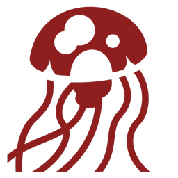

# Mycroft

Mycroft is a fun and simple Go-based application that translates ASCII characters into Jellyfish Emojis and vice versa. This project is a small side endeavor to improve Go programming skills and explore the world of whimsical text transformations. Please note that Mycroft is not optimized for production use but serves as a fun coding exercise.

## Table of Contents

- [Installation](#installation)
- [Features](#features)
- [Contributing](#contributing)
- [License](#license)
- [Acknowledgments](#acknowledgments)

## Installation

You can find the downloadable APK for Mycroft in the [Releases](https://github.com/BlyDoesCoding/Mycroft/releases) section. Download the APK file suitable for your device and follow your device's installation instructions.

## Features

- Translate clipboard text into Jellyfish Emojis or back with ease.
- A simple and fun way to experiment with text transformations.
- Provides a downloadable APK for easy installation on your device.

## Contributing

Contributions to Mycroft are welcome! If you'd like to contribute to this project, please follow these guidelines:

1. Fork the repository.
2. Create a new branch for your feature or bug fix.
3. Make your changes and test them thoroughly.
4. Submit a pull request, describing your changes in detail.

## License

This project is licensed under the [BSD 3-Clause License](LICENSE). See the [LICENSE](LICENSE) file for details.

## Acknowledgments

- Special thanks to the Go programming community for their valuable resources and tutorials.

Enjoy translating your text into Jellyfish Emojis with Mycroft!
